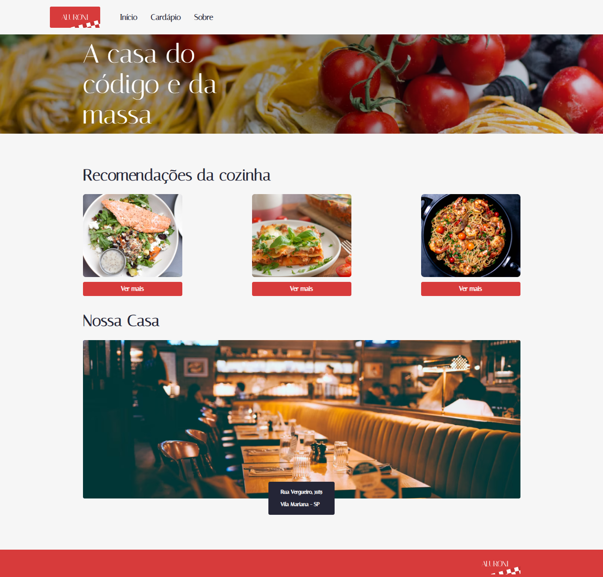
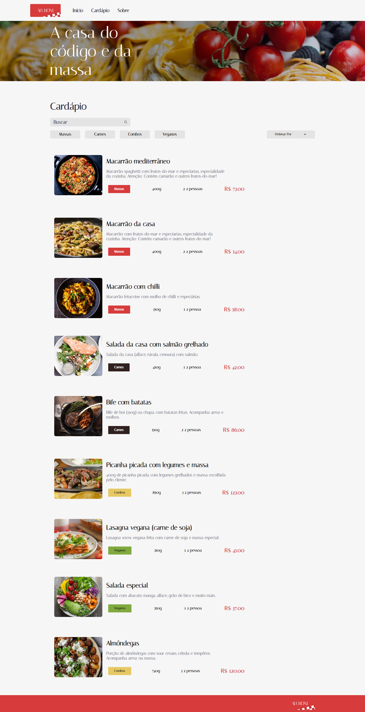
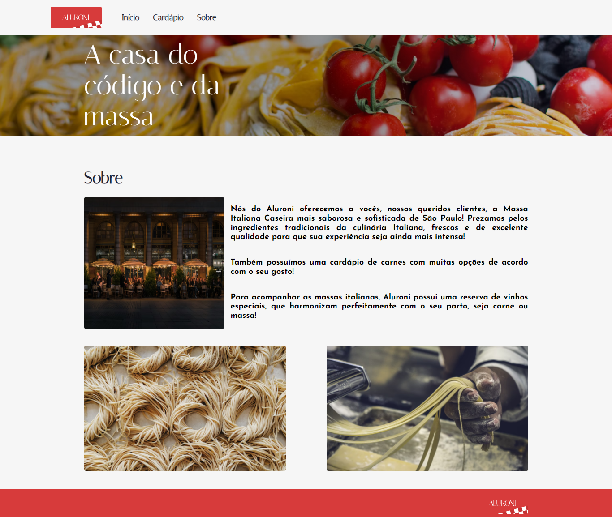

  

> <h2>Índice</h2>

<ul>
	<li>Sobre</li>
	<li>Tecnologias</li>
	<li>Um Pouco do Projeto</li>
	<li>Instalando</li>
</ul>

## Sobre

  

  O projeto Aluroni consiste em um restaurante italiano com diversos pratos em seu cardápio que agrada todos os gostos. Com essa premissa, esse site foi desenvolvido no aprendizado de trabalhar com a biblioteca React Router e desenvolver um código limpo e fácil de entender. Além disso, é um projeto de grande aprendizado com refatoração de código utilizando o ESLint, trabalhar com o react-router-dom de forma simples e prática, e desenvolver as telas com reaproveitamento de componentes. 

## Tecnologias
<ul>
	<li>HTML</li>
	<li>CSS</li>
	<li>JavaScript</li>
	<li>TypeScript</li>
  <li>React</li>
</ul>

## Um Pouco do Projeto

 > ### Cardápio
  
 O Cardápio foi desenvolvido com 4 tipos diferentes de pratos e certamente com um filtro para pesquisa do mesmo. Além disso, possui uma barra de pesquisa e um ordenador para facilitar as buscas.

  
  

 > ### Sobre
  
 A tela de Sobre fica com a descrição completa do restaurante.

  
  

## Instalando

Para utilizar o projeto é necessário ter o Node.JS na versão LTS.

Este projeto foi inicializado com [Create React App]

  ### Instalando as dependências
  
  `npm install`

  ### No diretório do projeto, você pode executar:

 `npm start`

  Executa o aplicativo no modo de desenvolvimento.\
  Abra [http://localhost:3000](http://localhost:3000) para visualizá-lo no navegador.
  
  A página será recarregada se você fizer edições.\
  Você também verá alguns erros de lint no console.
  
  ### Inicie o executor de teste no modo de observação interativo.
   `teste npm`
